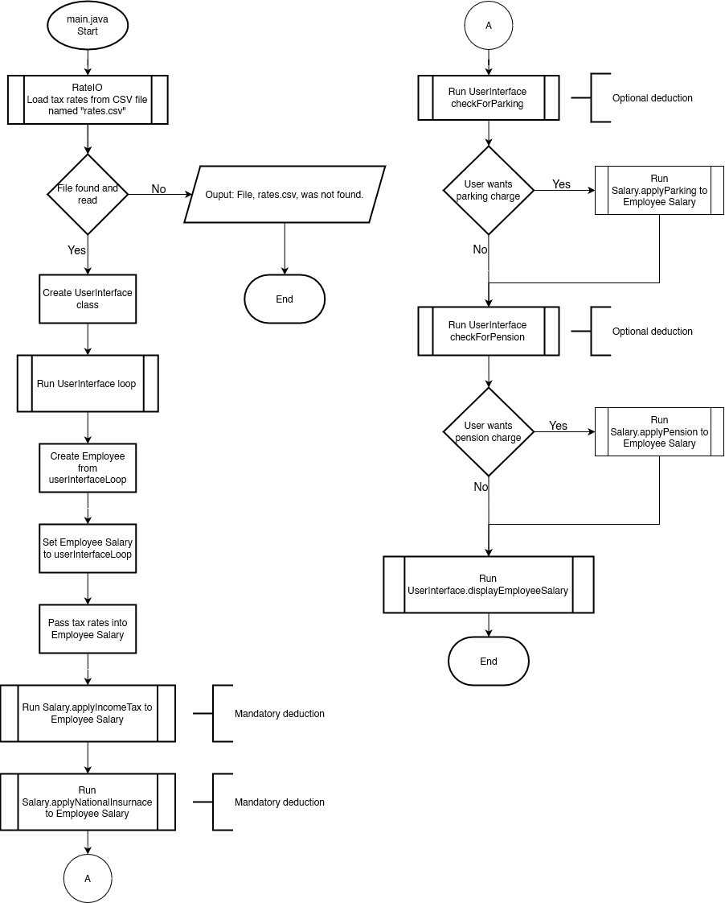
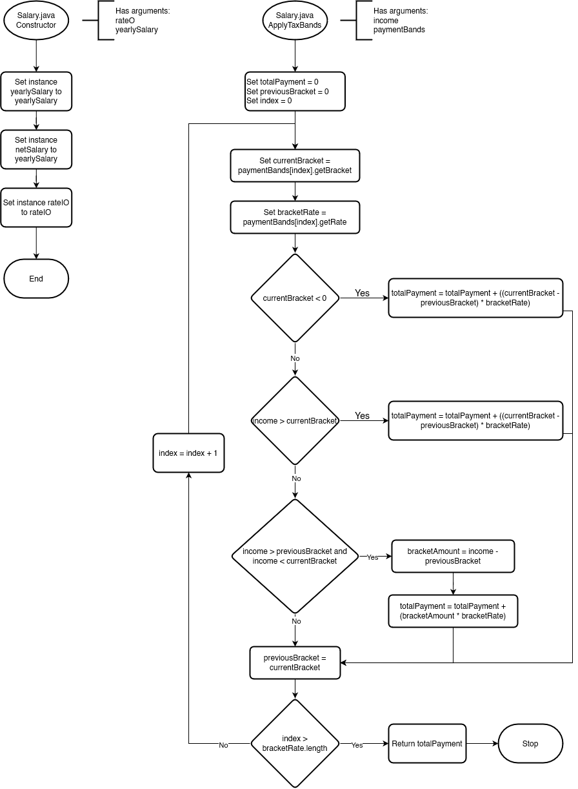
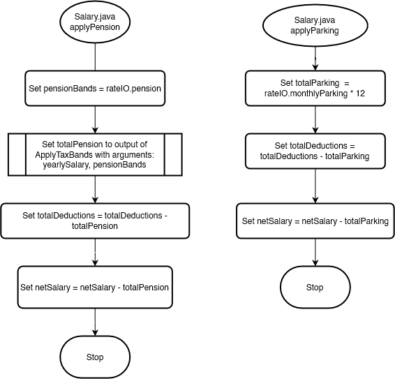

# Part A - Design Task

## Part 1 User Login and Unique Pin

## Part 2 - Employee Pay Calculator

# Part B - Programming Task

## Part 1 User Login and Unique Pin

### Program Source Code

#### `Main.java`

### Program Unit Tests

### Program Outputs

## Part 2 - Employee Pay Calculator

### Design Process










### Program Source Code
 
#### `Main.java`

\mbox{}

```java
package usw.employeepay;

import java.io.IOException;
import java.util.Scanner;

public class Main {
    public static void main(String[] args) {
        RateIO rateIO;
        try {
            rateIO = new RateIO("rates.csv");


        } catch (IOException e) {
            System.out.println("File, rates.csv, was not found. Make sure rates.csv is run in same folder as the " +
                    "program");
            return;
        }
        Scanner scanner = new Scanner(System.in);
        UserInterface userInput = new UserInterface(scanner);
        Employee employee = userInput.createEmployeeLoop();
        employee.setEmployeeSalary(userInput.getSalaryLoop(rateIO));

        /* Apply income tax and national insurance */
        employee.getSalary().applyMandatoryDeductions();

        /* Check if user wants to apply optional deductions */
        if (userInput.userApplyParking()) {
            employee.getSalary().applyParkingCharge();
        }
        if (userInput.userApplyPension()) {
            employee.getSalary().applyPension();
        }
        UserInterface.displayEmployeeSalary(employee);
    }
}
```

#### `UserInterface.java`

\mbox{}

```java
package usw.employeepay;

import java.math.BigDecimal;
import java.math.RoundingMode;
import java.util.InputMismatchException;
import java.util.Scanner;

public class UserInterface {

    private final Scanner scanner;


    /**
     * Class that handles outputting and accepting user input
     *
     * @param scanner Input handling
     */
    public UserInterface(Scanner scanner) {
        this.scanner = scanner;
    }


    /**
     * Outputs the information concerning an employee's salary
     *
     * @param employee Employee to display salary of
     */
    public static void displayEmployeeSalary(Employee employee) {

        System.out.println("\nCalculating yearly net pay...\n");
        System.out.printf("""
            Gross salary: £%s
            Taxable amount: £%s
            Tax paid: £%s
            National insurance paid: £%s
            """, 
            employee.getSalary().getGrossSalary(), 
            employee.getSalary().getTaxableAmount(),
            employee.getSalary().getIncomeTaxAmount(), 
            employee.getSalary().getNIAmount()
        );

        /* Non-required deductions */
        if (!(employee.getSalary().getTotalParking() == null)) {
            System.out.printf("Parking charge: £%s\n",
                employee.getSalary().getTotalParking()
            );
        }

        if (!(employee.getSalary().getPensionAmount() == null)) {
            System.out.printf("Pension charge: £%s\n", 
                employee.getSalary().getPensionAmount()
            );
        }

        System.out.printf("\nTotal deductions: £%s\n",
            employee.getSalary().getTotalDeductions()
        );
        System.out.printf("Yearly net pay: £%s\n",
            employee.getSalary().getNetSalary()
        );


        System.out.println("\nCalculating monthly net pay...\n");
        System.out.printf("""
            Gross salary: £%s
            Taxable amount: £%s
            Tax paid: £%s
            National insurance paid: £%s
            """, 
            Salary.convertMonthly(
                employee.getSalary().getGrossSalary()
            ),
            Salary.convertMonthly(
                employee.getSalary().getTaxableAmount()
            ),
            Salary.convertMonthly(
                employee.getSalary().getIncomeTaxAmount()
            ),
            Salary.convertMonthly(
                employee.getSalary().getNIAmount()
            )
        );


        /* Non-required deductions */
        if (!(employee.getSalary().getTotalParking() == null)) {
            System.out.printf("Parking charge: £%s\n", 
                Salary.convertMonthly(employee.getSalary().getTotalParking())
            );
        }

        if (!(employee.getSalary().getPensionAmount() == null)) {
            System.out.printf("Pension charge: £%s\n",
                Salary.convertMonthly(employee.getSalary().getPensionAmount())
            );
        }

        System.out.printf("\nMonthly total deductions: £%s\n",
            Salary.convertMonthly(employee.getSalary().getTotalDeductions())
        );

        System.out.printf("Monthly net pay: £%s\n",
            employee.getSalary().getMonthlyNetSalary()
        );
    }

    /**
     * UI loop constructs an Employee class and returns it
     * Uses validation
     *
     * @return Constructed Employee object
     */
    public Employee createEmployeeLoop() {

        String employeeName;
        int employeeNumber;

        System.out.println(
            "Welcome to USW Employee Salary Calculator"
        );
        System.out.println(
            "-----------------------------------------"
        );

        while (true) {
            System.out.print("Employee Name: ");
            employeeName = scanner.nextLine();
            if (!employeeName.isEmpty()) {
                break;
            }
            System.out.println("Empty inputs are not accepted.");
        }

        while (true) {
            System.out.print("Employee number: ");
            try {
                employeeNumber = scanner.nextInt();
                break;
            } catch (InputMismatchException e) {
                System.out.println(
                    "Letter are not allowed employee number"
                );
                /* nextLine clears the newline from nextInt() avoiding
                duplicates of above message */
                scanner.nextLine();
            }
        }
        return new Employee(employeeName, employeeNumber);
    }

    /**
     * UI loop that constructs Salary that is filled with tax information
     *
     * @param rateIO The tax bands to use in initial instantiation of taxes, pension, etc.
     * @return Constructed Salary object
     */
    public Salary getSalaryLoop(RateIO rateIO) {

        BigDecimal yearSalary;

        while (true) {
            System.out.print("Yearly salary: ");
            try {
                String inputSalary = scanner.next();
                yearSalary = new BigDecimal(inputSalary);
                yearSalary = yearSalary.setScale(2, RoundingMode.HALF_UP);
                /* Clear the newline character from scanner buffer
                 * Otherwise next question would appear twice, as the
                 * scanner would pick up the leftover newline
                 */
                scanner.nextLine();
                System.out.println(yearSalary);
                break;
            } catch (NumberFormatException e) {
                System.out.println(
                    "Letter are not allowed in the employee number"
                );
            }
        }
        return new Salary(yearSalary, rateIO);
    }

    /**
     * Asks user if they want to apply a parking charge
     *
     * @return To apply parking charge or not
     */
    public boolean userApplyParking() {

        while (true) {
            System.out.println(
                "Do you want to apply a parking charge? (y/n)"
            );
            // Normalise characters to lowercase
            String parkingInput = scanner.nextLine().toLowerCase();
            switch (parkingInput) {
                case "y": {
                    return true;
                }
                case "n": {
                    return false;
                }
            }
        }
    }

    /**
     * Asks the user if they want to apply a teacher's pension
     *
     * @return bool indicating to apply pension or not
     */
    public boolean userApplyPension() {
        while (true) {
            System.out.println(
                "Do you want to apply a teachers pension? (y/n)"
            );
            // Normalise characters to lowercase
            String parkingInput = scanner.nextLine().toLowerCase();
            switch (parkingInput) {
                case "y": {
                    return true;
                }
                case "n": {
                    return false;
                }
            }
        }
    }
}
```

#### `Employee.java`

\mbox{}

```java
package usw.employeepay;

public class Employee {

    private final int employeeNum;
    private final String name;
    private Salary employeeSalary;

    /**
     * Creates employee
     *
     * @param name        Employee name
     * @param employeeNum Employee number
     */
    public Employee(String name, int employeeNum) {
        this.name = name;
        this.employeeNum = employeeNum;
    }

    public String getName() {
        return name;
    }

    public int getEmployeeNum() {
        return employeeNum;
    }

    public Salary getSalary() {
        return employeeSalary;
    }

    /**
     * Adds Salary to Employee
     *
     * @param employeeSalary Salary object
     */
    public void setEmployeeSalary(Salary employeeSalary) {
        this.employeeSalary = employeeSalary;
    }
}
```

#### `Salary.java`

\mbox{}

```java
package usw.employeepay;

import java.math.BigDecimal;
import java.math.RoundingMode;
import java.util.LinkedHashMap;
import java.util.Map;

/**
 * Class that contains information and methods related to Salary.
 * Includes: income tax, national insurance, pensions, and
 * parking charges
 */
public class Salary {

    iRateIO rateIO;

    /**
     * BigDecimal used as we are working with money
     * Avoids errors concerning floating-point representation
     */
    private BigDecimal grossSalary;
    private BigDecimal netSalary;
    private BigDecimal totalDeductions = new BigDecimal("0");
    private BigDecimal totalIncomeTax;
    private BigDecimal totalNI;
    private BigDecimal totalPension;
    private BigDecimal totalParking;

    public Salary(BigDecimal grossSalary, iRateIO rateIO) {
        this.grossSalary = grossSalary;
        netSalary = grossSalary;
        this.rateIO = rateIO;
    }

    public static BigDecimal convertMonthly(BigDecimal amount) {
        return amount.divide(new BigDecimal("12"), 2, RoundingMode.HALF_UP);
    }

    /**
     * Applies required deductions: income tax, national insurance
     */
    public void applyMandatoryDeductions() {
        applyIncomeTax();
        applyNationalInsurance();
    }

    public void applyIncomeTax() {
        totalIncomeTax = applyPaymentBands(grossSalary,
            rateIO.getTaxBands()
        );
        totalDeductions = totalDeductions.add(totalIncomeTax);
        netSalary = netSalary.subtract(totalIncomeTax);
    }

    public void applyNationalInsurance() {
        totalNI = applyPaymentBands(grossSalary,
            rateIO.getNationalInsurance()
        );
        totalDeductions = totalDeductions.add(totalNI);
        netSalary = netSalary.subtract(totalNI);
    }

    public void applyPension() {
        totalPension = applyPaymentBands(grossSalary,
            rateIO.getPensionBands()
        );
        totalDeductions = totalDeductions.add(totalPension);
        netSalary = netSalary.subtract(totalPension);
    }

    public void applyParkingCharge() {
        // Monthly parking * 12
        totalParking = rateIO.getMonthlyParking().multiply(
            new BigDecimal("12")
        );
        totalDeductions = totalDeductions.add(totalParking);
        netSalary = netSalary.subtract(totalParking);
    }

    /**
     * Applies payment bands to income dynamically
     *
     * @param income       Accepts BigDecimals, no negatives
     * @param paymentBands LinkedHashMap containing, the taxBand first, 
     *                     then the taxRate, overflow tax rates
     *                     should be denoted with a negative
     *                     on the band
     * @return Total payment on income after paymentBands applied
     */
    private BigDecimal applyPaymentBands(BigDecimal income, LinkedHashMap<BigDecimal, BigDecimal> paymentBands) {

        BigDecimal totalPayment = new BigDecimal("0");
        BigDecimal previousBracket = new BigDecimal("0");

        for (Map.Entry<BigDecimal, BigDecimal> entry : paymentBands.entrySet()) {
            BigDecimal currentBracket = entry.getKey();
            BigDecimal bracketRate = entry.getValue;


            /*
             * If the payment is in a band denoted with a negative 
             * number then it is overflow, and applies
             * that rate to rest of salary
             */
            if (currentBracket.compareTo(BigDecimal.ZERO) < 0) {
                /* totalPayment = totalPayment + 
                 * (income - previousBand) * taxRate
                 */
                totalPayment = totalPayment.add(
                    income.subtract(previousBracket).multiply(bracketRate).setScale(2,RoundingMode.HALF_UP)
                );
            } else if (income.compareTo(entry.getKey()) > 0) {
                /* If the income is greater than the current 
                 * payment band 
                 */

                /* totalPayment = totalPayment + 
                 * (currentBracket - previousBand) * taxRate
                 * It then rounds to 2 decimal places
                 */
                totalPayment = totalPayment.add((
                    entry.getKey().subtract(previousBracket)).multiply(
                        entry.getValue()).setScale(2, RoundingMode.HALF_UP)
                );

            } else if ((income.compareTo(previousBracket) > 0) && (income.compareTo(entry.getKey()) < 0)) {
                /* If the income is smaller than the current payment 
                 * band 
                 */

                /* Get the leftover money in the band */
                BigDecimal bracketAmount = income.subtract(previousBracket);
                /* apply tax to the leftover amount in the band
                 * totalPayment = totalPayment +
                 * (leftoverAmount * taxRate)
                 */
                totalPayment = totalPayment.add(
                    bracketAmount.multiply(entry.getValue()).setScale(2, RoundingMode.HALF_UP)
                );
                /* Since income is smaller than current band, won't 
                 * make it to next band, break out of loop 
                 */
                break;
            }
            previousBracket = entry.getKey();
        }
        return totalPayment;
    }

    // Setters

    public void setSalary(BigDecimal grossSalary) {
        this.grossSalary = grossSalary;
        netSalary = grossSalary;
        applyMandatoryDeductions();
    }

    public void setRateIO(iRateIO rateIO) {
        this.rateIO = rateIO;
        applyMandatoryDeductions();
    }

    // Getters

    public BigDecimal getGrossSalary() {
        return grossSalary;
    }

    public BigDecimal getMonthlySalary() {
        return convertMonthly(grossSalary);
    }

    public BigDecimal getTaxableAmount() {
        return grossSalary.subtract(new BigDecimal("12570"));
    }

    public BigDecimal getIncomeTaxAmount() {
        return totalIncomeTax;
    }

    public BigDecimal getNIAmount() {
        return totalNI;
    }

    public BigDecimal getPensionAmount() {
        return totalPension;
    }

    public BigDecimal getTotalParking() {
        return totalParking;
    }

    public BigDecimal getTotalDeductions() {
        return totalDeductions;
    }

    public BigDecimal getNetSalary() {
        return netSalary;
    }

    public BigDecimal getMonthlyNetSalary() {
        return netSalary.divide(
            new BigDecimal("12"), 2, RoundingMode.HALF_UP
        );
    }
}
```

#### `iRateIO.java`

\mbox{}

```java
package usw.employeepay;

import java.math.BigDecimal;
import java.util.LinkedHashMap;

/**
 * Interface for RateIO. Multiple implementations that use file
 * reading, and mocked set values for testing purposes
 */
public interface iRateIO {
    LinkedHashMap<BigDecimal, BigDecimal> getTaxBands();

    LinkedHashMap<BigDecimal, BigDecimal> getNationalInsurance();

    LinkedHashMap<BigDecimal, BigDecimal> getPensionBands();

    BigDecimal getMonthlyParking();
}

```

#### `RateIO.java`

\mbox{}

```java
package usw.employeepay;

import java.io.IOException;
import java.math.BigDecimal;
import java.nio.file.Files;
import java.nio.file.Paths;
import java.util.Arrays;
import java.util.LinkedHashMap;
import java.util.List;

public class RateIO implements iRateIO {
    private final LinkedHashMap<BigDecimal, BigDecimal> taxBands = new LinkedHashMap<>();
    private final LinkedHashMap<BigDecimal, BigDecimal> pensionBands = new LinkedHashMap<>();
    private final LinkedHashMap<BigDecimal, BigDecimal> nationalInsurance = new LinkedHashMap<>();
    private BigDecimal monthlyParking;

    /**
     * Reads a CSV for tax bands, national insurance, and
     * @param filePath String of file path
     * @throws IOException If file does not exist / is not found
     */
    public RateIO(String filePath) throws IOException {
        List<String> lines = Files.readAllLines(Paths.get(filePath));
        // Each line runs the parseLine function
        lines.forEach(line -> 
            parseLine(Arrays.asList(line.split(",")))
        );
    }

    /**
     * Handle the separated line and add it to a tax band
     * @param line Line to parse
     */
    private void parseLine(List<String> line) {
        /* Each type of deduction possible in CSV */
        switch (line.get(0)) {
            case "tax" -> taxBands.put(
                new BigDecimal(line.get(1)), 
                new BigDecimal(line.get(2))
            );
            case "pension" -> pensionBands.put(
                new BigDecimal(line.get(1)), 
                new BigDecimal(line.get(2))
            );
            case "nationalInsurance" -> nationalInsurance.put(
                new BigDecimal(line.get(1)),
                new BigDecimal(line.get(2))
            );
            case "parking" -> monthlyParking = (
                new BigDecimal(line.get(1))
            );
        }
    }

    public LinkedHashMap<BigDecimal, BigDecimal> getTaxBands() {
        return taxBands;
    }

    public LinkedHashMap<BigDecimal, BigDecimal> getNationalInsurance() {
        return nationalInsurance;
    }

    public LinkedHashMap<BigDecimal, BigDecimal> getPensionBands() {
        return pensionBands;
    }

    public BigDecimal getMonthlyParking() {
        return monthlyParking;
    }
}

```

### Program Unit Tests

#### `SalaryTest.java`

\mbox{}

```java
package usw.employeepay;

import org.junit.jupiter.api.DisplayName;
import org.junit.jupiter.api.Test;

import java.math.BigDecimal;

import static org.junit.jupiter.api.Assertions.assertEquals;

class SalaryTest {

    TestingFakeRateIO testingRateIO = new TestingFakeRateIO();
    Salary testSalary = new Salary(
        new BigDecimal("45000"), testingRateIO
    );
    Salary testSalaryDecimal = new Salary(
        new BigDecimal("50000"), testingRateIO
    );
    Salary testSalaryLarge = new Salary(
        new BigDecimal("140000"), testingRateIO)
    ;

    @Test
    @DisplayName("Calculate monthly salary")
    public void monthlySalaryCalculations() {
        BigDecimal expectedMonthlySalary2 = new BigDecimal("3750");

        assertEquals(0, expectedMonthlySalary2.compareTo(
            testSalary.getMonthlySalary())
        );

        BigDecimal expectedMonthlySalary1 = new BigDecimal("4166.67");

        assertEquals(0, expectedMonthlySalary1.compareTo(
            testSalaryDecimal.getMonthlySalary())
        );

    }

    @Test
    @DisplayName("Calculate taxable amount")
    public void getTaxableAmount() {
        BigDecimal expectedTaxableAmount = new BigDecimal("32430.00");

        assertEquals(0, expectedTaxableAmount.compareTo(
            testSalary.getTaxableAmount())
        );
    }

    @Test
    @DisplayName("Calculate income tax")
    public void calculateIncomeTax() {
        BigDecimal expectedTax = new BigDecimal("6486");
        testSalary.applyIncomeTax();

        assertEquals(0, expectedTax.compareTo(
            testSalary.getIncomeTaxAmount())
        );

        BigDecimal expectedTaxLarge = new BigDecimal("44175");
        testSalaryLarge.applyIncomeTax();

        assertEquals(0, expectedTaxLarge.compareTo(
            testSalaryLarge.getIncomeTaxAmount())
        );
    }

    @Test
    @DisplayName("Calculate national insurance")
    void calculateNationalInsurance() {
        BigDecimal expectedNI = new BigDecimal("4251.84");
        testSalary.applyNationalInsurance();

        assertEquals(0, expectedNI.compareTo(
            testSalary.getNIAmount())
        );
    }

    @Test
    @DisplayName("Parking charge applies")
    void useParkingCharge() {
        BigDecimal expectedNetSalary = new BigDecimal("34142.16");
        BigDecimal monthlyParking = new BigDecimal("120.00");
        testSalary.applyMandatoryDeductions();
        testSalary.applyParkingCharge();

        assertEquals(0, monthlyParking.compareTo(
            testSalary.getTotalParking())
        );
        assertEquals(0, expectedNetSalary.compareTo(
            testSalary.getNetSalary())
        );
    }

    @Test
    @DisplayName("Total teachers pension")
    void getTotalTeachersPension() {
        BigDecimal expectedTeachersPension = new BigDecimal("3501.76");
        testSalary.applyPension();

        assertEquals(0, expectedTeachersPension.compareTo(
            testSalary.getPensionAmount())
        );
    }

    @Test
    @DisplayName("Total deductions")
    void getTotalDeductions() {
        BigDecimal expectedDeductions = new BigDecimal("10737.84");
        testSalary.applyMandatoryDeductions();

        assertEquals(0, expectedDeductions.compareTo(
            testSalary.getTotalDeductions())
        );
    }

    @Test
    @DisplayName("Net salary")
    void getNetSalary() {
        BigDecimal expectedNetSalary = new BigDecimal("34142.16");
        testSalary.applyMandatoryDeductions();
        testSalary.applyParkingCharge();

        assertEquals(0, expectedNetSalary.compareTo(
            testSalary.getNetSalary())
        );
    }
}
```

#### `RateIOTest.java`

\mbox{}

```java

package usw.employeepay;

import org.junit.jupiter.api.BeforeEach;
import org.junit.jupiter.api.DisplayName;
import org.junit.jupiter.api.Test;

import java.io.IOException;
import java.math.BigDecimal;
import java.util.LinkedHashMap;

import static org.junit.jupiter.api.Assertions.assertEquals;

class RateIOTest {
    private RateIO rateIO;

    @BeforeEach
    void setUp() {
        try {
            rateIO = new RateIO("rates.csv");

        } catch (IOException e) {
            System.out.println(e);
        }
    }

    @Test
    @DisplayName("CSV tax bands")
    void getTaxBands() {
        LinkedHashMap<BigDecimal, BigDecimal> expectedTaxBands = new LinkedHashMap<>();
        expectedTaxBands.put(
            new BigDecimal("12570"), new BigDecimal("0.00")
        );
        expectedTaxBands.put(
            new BigDecimal("50270"), new BigDecimal("0.20")
        );
        expectedTaxBands.put(
            new BigDecimal("125140"), new BigDecimal("0.40")
        );
        expectedTaxBands.put(
            new BigDecimal("-1"), new BigDecimal("0.45")
        );
        assertEquals(expectedTaxBands, rateIO.getTaxBands());
    }

    @Test
    @DisplayName("NI tax bands")
    void getNationalInsurance() {
        LinkedHashMap<BigDecimal, BigDecimal> expectedNationalInsurance = new LinkedHashMap<>();
        expectedNationalInsurance.put(
            new BigDecimal("9568"), new BigDecimal("0.00")
        );
        expectedNationalInsurance.put(
            new BigDecimal("-1"), new BigDecimal("0.12")
        );
        assertEquals(expectedNationalInsurance, rateIO.getNationalInsurance());
    }

    @Test
    @DisplayName("Pension tax bands")
    void getPensionBands() {
        LinkedHashMap<BigDecimal, BigDecimal> expectedPensionBands = new LinkedHashMap<>();

        expectedPensionBands.put(
            new BigDecimal("32135.99"), new BigDecimal("0.074")
        );
        expectedPensionBands.put(
            new BigDecimal("43259.99"), new BigDecimal("0.086")
        );
        expectedPensionBands.put(
            new BigDecimal("51292.99"), new BigDecimal("0.096")
        );
        expectedPensionBands.put(
            new BigDecimal("67980.99"), new BigDecimal("0.102")
        );
        expectedPensionBands.put(
            new BigDecimal("92597.99"), new BigDecimal("0.113")
        );
        expectedPensionBands.put(
            new BigDecimal("-1"), new BigDecimal("0.117")
        );
        assertEquals(expectedPensionBands, rateIO.getPensionBands());
    }

    @Test
    @DisplayName("CSV parking fee")
    void getMonthlyParking() {
        BigDecimal expectedMonthlyParking = new BigDecimal("10.00");
        assertEquals(0, expectedMonthlyParking.compareTo(
            rateIO.getMonthlyParking())
        );
    }
}
```

#### `UserInterfaceTest.java`

\mbox{}

```java
package usw.employeepay;

import org.junit.jupiter.api.DisplayName;
import org.junit.jupiter.api.Test;

import java.io.ByteArrayInputStream;
import java.util.Scanner;

class UserInterfaceTest {

    @Test
    @DisplayName("Valid input in name field")
    void nameValidInput() {

        String dataIn = "Jake Real\n4324324\n423432";
        ByteArrayInputStream in = new ByteArrayInputStream(
            dataIn.getBytes()
        );
        System.setIn(in);

        Scanner scanner = new Scanner(System.in);

        UserInterface userInput = new UserInterface(scanner);
        userInput.createEmployeeLoop();
    }
}
```


### Program Outputs

Running Main.java:

```
Welcome to USW Employee Salary Calculator
-----------------------------------------
Employee Name: jake
Employee number: 43232
Yearly salary: 45000
45000.00
Do you want to apply a parking charge? (y/n)
n
Do you want to apply a teachers pension? (y/n)
n

Calculating yearly net pay...

Gross salary: £45000.00
Taxable amount: £32430.00
Tax paid: £6486.00
National insurance paid: £4251.84

Total deductions: £10737.84
Yearly net pay: £34262.16

Calculating monthly net pay...

Gross salary: £3750.00
Taxable amount: £2702.50
Tax paid: £540.50
National insurance paid: £354.32

Monthly total deductions: £894.82
Monthly net pay: £2855.18
```

